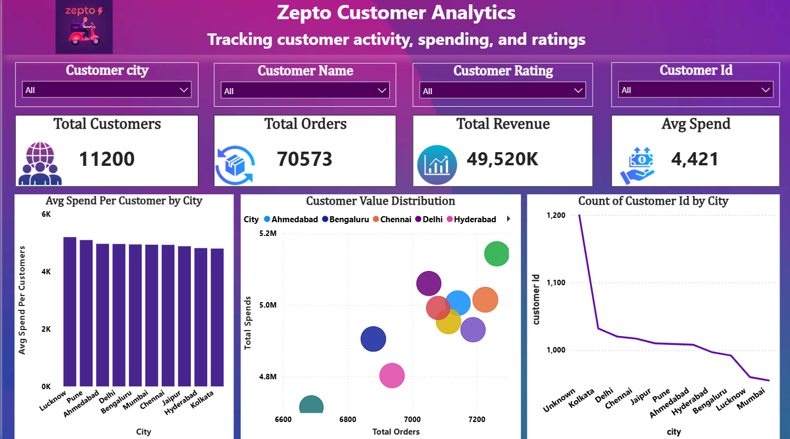
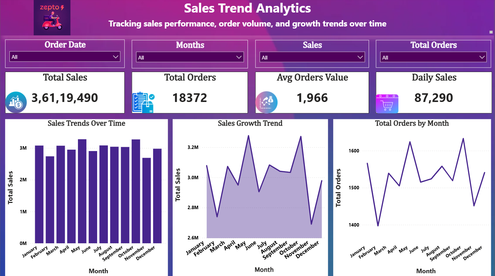
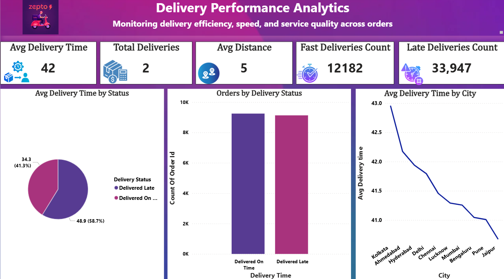
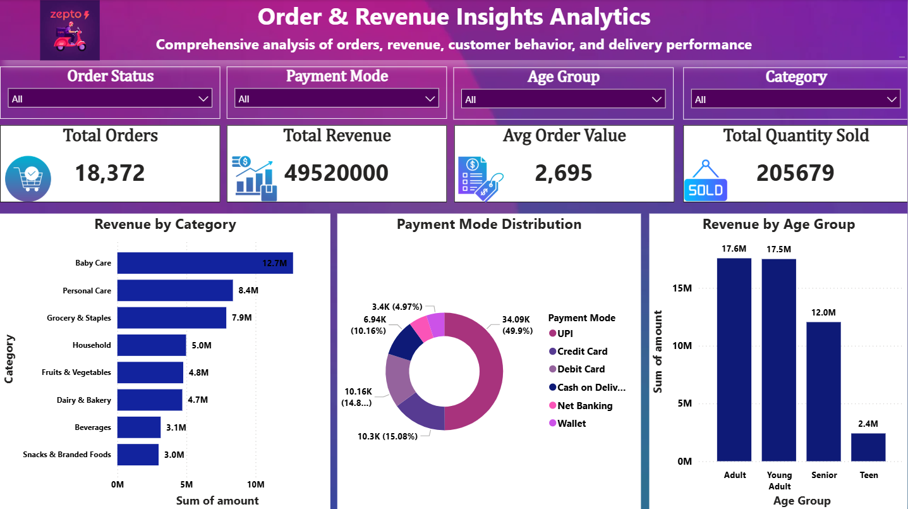
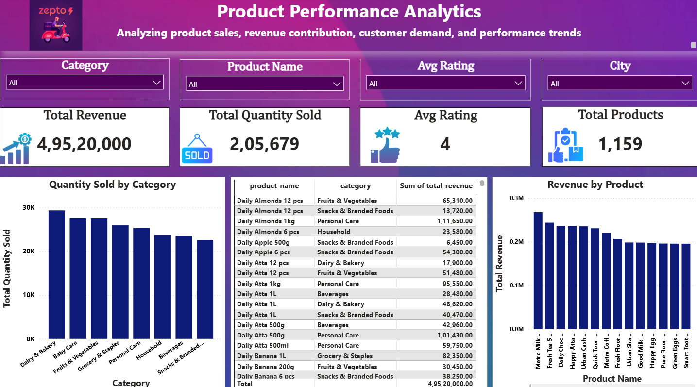

# 🚀 Zepto 360° Business Analytics Dashboard

## 📌 Project Overview

This project is an end-to-end Business Analytics solution developed using SQL and Power BI to analyze operational performance of Zepto.

The solution integrates customer, order, product, transaction, delivery, and rating datasets to generate actionable business insights through interactive dashboards.

---

# 🎯 Project Objectives

- Analyze sales and revenue performance
- Understand customer purchasing behavior
- Monitor delivery efficiency
- Evaluate product performance
- Generate data-driven business insights

---

# 🗂️ Dataset Information

The project uses 6 relational datasets:

| Table Name | Description |
|---|---|
| Customers | Customer details and demographics |
| Orders | Order-level information |
| Products | Product catalog and categories |
| Transactions | Sales and payment details |
| Delivery | Delivery time and status |
| Ratings | Customer ratings and reviews |

---

# 🧹 Data Cleaning & Transformation

Performed using SQL:

- Removed duplicate records
- Handled null values
- Standardized text formatting
- Created derived columns
- Built SQL analytical views

---

# 🛠 SQL Views Created

## 1️⃣ Customer Summary View
- Customer spending behavior
- Total orders
- Average ratings
- Revenue contribution

## 2️⃣ Daily Sales View
- Daily sales trends
- Revenue growth analysis
- Order performance tracking

## 3️⃣ Delivery Performance View
- Delivery efficiency metrics
- Delivery time analysis
- Distance tracking

## 4️⃣ Order Details View
- Combined customer, product, delivery, and transaction data
- Complete order-level insights

## 5️⃣ Product Performance View
- Product revenue analysis
- Quantity sold
- Product ratings and category performance

---

# 📊 Power BI Dashboards

## 1️⃣ Customer Analytics Dashboard
### Insights:
- Customer spending behavior
- City-wise customer analysis
- Customer segmentation
- Revenue contribution

---

## 2️⃣ Sales Trend Analytics Dashboard
### Insights:
- Daily sales trends
- Revenue growth patterns
- Order trend monitoring
- Peak sales analysis

---

## 3️⃣ Delivery Performance Analytics Dashboard
### Insights:
- Delivery efficiency analysis
- Delivery time monitoring
- Distance vs delivery trends
- Delivery success tracking

---

## 4️⃣ Order & Revenue Insights Dashboard
### Insights:
- Revenue analysis
- Order tracking
- Payment mode analysis
- Category performance

---

## 5️⃣ Product Performance Analytics Dashboard
### Insights:
- Product revenue analysis
- Product ratings
- Top-selling products
- Category-wise performance

---

# 📷 Dashboard Screenshots

## 1️⃣ Customer Analytics Dashboard



---

## 2️⃣ Sales Trend Analytics Dashboard



---

## 3️⃣ Delivery Performance Analytics Dashboard



---

## 4️⃣ Order & Revenue Insights Dashboard



---

## 5️⃣ Product Performance Analytics Dashboard


---

# 📈 Key Insights

- High-performing cities generated major revenue share
- Top-selling products contributed significant business impact
- Delivery delays increased with distance
- Digital payment methods were most preferred
- Some product categories received higher customer ratings

---

# 💡 Business Recommendations

- Optimize delivery routes for faster service
- Focus marketing on high-performing products
- Improve operational efficiency in slow-performing regions
- Enhance customer retention strategies
- Monitor cancelled orders to reduce revenue loss

---

# 📌 Data Modeling

- Implemented fact and dimension modeling
- Created relationships using:
  - customer_id
  - order_id
  - product_id
- Built optimized Power BI data model
- Developed DAX measures and KPIs

---

# 📊 KPIs Implemented

- Total Revenue
- Total Orders
- Avg Order Value
- Avg Rating
- Avg Delivery Time
- Delivery Success %
- Total Quantity Sold

---

# 🧰 Tools & Technologies

| Category | Tools |
|---|---|
| Database | MySQL |
| Visualization | Power BI |
| Query Language | SQL |
| Spreadsheet | Excel |
| BI Functions | DAX |

---

# 🧠 Skills Demonstrated

- Data Cleaning
- SQL Joins & Views
- Data Transformation
- Data Modeling
- DAX Calculations
- Dashboard Design
- Business Analytics
- Data Visualization

---

# 📂 Repository Structure

```text
zepto-360-business-analytics/
│
├── dataset/
├── sql/
├── powerbi/
├── ppt/
├── images/
└── README.md
```

---

# 🚀 Future Enhancements

- Real-time dashboard integration
- Predictive sales analysis
- Customer retention modeling
- Delivery optimization analytics

---

# 👨‍💻 Author

## Roz Rajak


---

# ⭐ Project Highlights

✔ End-to-end analytics workflow  
✔ SQL-based data transformation  
✔ Interactive Power BI dashboards  
✔ Business-focused KPI analysis  
✔ Professional dashboard storytelling  
✔ Data-driven business insights